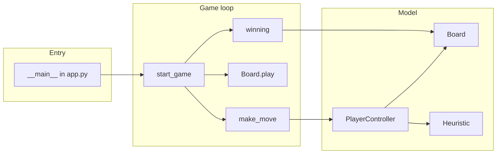

# N-in-a-Row Solver

A terminal-based **Connect Four–style** game for configurable board sizes and win lengths (*n* in a row). The codebase separates the game model, human/AI players, and heuristics, and uses **NumPy** for the board representation and **Numba** to JIT-compile hot paths (win detection and heuristic scoring).

---

## Table of contents

- [Overview](#overview)
- [How the code works](#how-the-code-works)
- [Requirements](#requirements)
- [Installation](#installation)
- [Running the application](#running-the-application)
- [Configuration](#configuration)
- [Project structure](#project-structure)
- [Authors](#authors)
- [License](#license)

---

## Overview

Two players take turns dropping pieces into columns; pieces fall to the lowest free cell in that column. The first player to align *n* pieces horizontally, vertically, or diagonally wins. If the board fills with no winner, the game is a draw.

The default entry point runs a **human vs human** match on a classic **7×6** board with **4** in a row (standard Connect Four parameters).

---

## How the code works

### High-level flow

1. **`app.py`** defines `start_game`, which loops until a terminal outcome:
   - The active player (from a two-element list) calls `make_move(board)` and receives a **column index** (0-based internally).
   - The move is applied with `Board.play`. Invalid moves cause a retry for that player.
   - After each successful move, **`winning`** inspects the full grid for a win or draw.

2. **`Board`** (`board.py`) stores state as a `numpy.ndarray` shaped `(width, height)`, with `0` = empty, `1` = player X, `2` = player O. It supports:
   - Playing in a column (`play`), checking legality (`is_valid`), and **immutable-style** branching via `get_new_board` (copy + apply move)—intended for search algorithms.

3. **`PlayerController`** (`players.py`) is the interface for any player:
   - **`HumanPlayer`**: prints the board, optionally shows a suggested column from the heuristic, then reads **1-based** column input from stdin with validation.
   - **`MinMaxPlayer`** / **`AlphaBetaPlayer`**: scaffolding for adversarial search; **full Minimax and alpha–beta are left as assignment work** (see inline `TODO`s). The current `MinMaxPlayer` uses a depth-1 style choice tied to the heuristic.

4. **`Heuristic`** (`heuristics.py`) assigns a numeric score to positions:
   - **`SimpleHeuristic`** returns strong values for win/loss/draw for the perspective player, otherwise a measure based on **longest contiguous run** of that player’s stones (horizontal, vertical, and diagonals).
   - **`get_best_action`** evaluates each legal column by applying the move and calling `evaluate_board`; it tracks how often evaluations run (`eval_count`), which the game prints at the end.

5. **Win detection** is implemented twice in spirit:
   - **`app.winning`**: Numba-JIT’d scan over columns, rows, and both diagonal directions, plus full-board draw detection.
   - **`Heuristic.winning`** delegates to `app.winning` to avoid duplicating terminal-test logic (lazy import avoids circular import issues at module load).

### Data flow (simplified)



---

## Requirements

| Component | Version / notes |
|-----------|-----------------|
| **Python** | **3.9–3.12** recommended (Numba `0.59.x` must match a [supported Python version](https://numba.readthedocs.io/) for your platform). |
| **numpy** | Pinned in `requirements.txt` (`2.1.0`). |
| **numba** | Pinned in `requirements.txt` (`0.59.1`). |

A C compiler is **not** required for normal use; Numba uses LLVM to compile on first run (cached afterward via `cache=True` on JIT decorators).

---

## Installation

### 1. Clone the repository

```bash
git clone git@github.com:SemDdVries/N-in-a-row_Solver.git
cd N-in-a-row_Solver
```

*(HTTPS alternative: `https://github.com/SemDdVries/N-in-a-row_Solver.git`)*

### 2. Create and activate a virtual environment (recommended)

**Windows (Command Prompt / PowerShell)**

```bash
python -m venv .venv
.venv\Scripts\activate
```

**macOS / Linux**

```bash
python3 -m venv .venv
source .venv/bin/activate
```

### 3. Install dependencies

```bash
pip install --upgrade pip
pip install -r requirements.txt
```

This installs exactly the versions listed in `requirements.txt` for reproducible runs.

---

## Running the application

From the repository root (with the virtual environment activated):

```bash
python app.py
```

The game prompts each human player for a **column number from 1 to width** (matching the header printed under the board). When the game ends, the final board is printed, the outcome is shown, and each player’s **heuristic evaluation count** is reported.

---

## Configuration

Default parameters are set in the `if __name__ == '__main__':` block in `app.py`:

| Variable | Default | Role |
|----------|---------|------|
| `game_n` | `4` | Number in a row required to win |
| `width` | `7` | Number of columns |
| `height` | `6` | Number of rows |

The assertion `1 < game_n <= min(width, height)` must hold. Edit these values and save to change the variant (e.g. larger boards or *n* > 4).

To use AI players instead of two humans, adjust **`get_players`** in `app.py`: construct `MinMaxPlayer` / `AlphaBetaPlayer` instances (with depth and heuristic) once those algorithms are implemented, and keep the existing assertions (distinct `player_id`, distinct heuristic instances, exactly two players).

---

## Project structure

```text
.
├── app.py            # Entry point, game loop, JIT win detection
├── board.py          # Board state, moves, string rendering
├── players.py        # Human and (stub) AI players
├── heuristics.py     # Heuristic interface and SimpleHeuristic
├── requirements.txt  # Pinned Python dependencies
└── README.md
```

---

## Authors

| Name | GitHub |
|------|--------|
| Sem de Vries | [@SemDdVries](https://github.com/SemDdVries) |

*Course context: Knowledge AI — Four in a Row / N-in-a-row assignment.*

If you contribute as a team, add rows to the table above so attribution stays accurate.

---

## License

No license file is included in this repository. If you publish or reuse this code outside the course, add a `LICENSE` file and clarify terms with your institution or collaborators.
